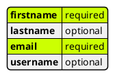
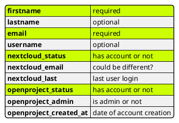

## Goal:
creating a scalable , highly automated process to onboard new members

---
## Architecture Decisions
- A Plone Grafitti instance is used to setup basic onboarding information (@maikroeder)
- CSV Files are used as information exchange format.  This is due to change in a later stage of the project, yet for now their easy readability and flexibility outweigh their disadvantages.
- Nextcloud is used to store and share Csv Assets
- Dagster is used to orchestrate data pipelines
---
```plantuml
participant Grafitti order 10
participant "Matrix Bot" as Matrix order 20
actor "Nextcloud User" as User order 30
database Nextcloud order 40
queue Dagster order 50
participant Openproject order 60
actor "Onboarding Admin" as Admin order 70
Grafitti -> Nextcloud : write onboarding.csv
Matrix -> Nextcloud: write onboarding.csv
User -[#orange]\ Nextcloud: edit onboarding.csv
Dagster -> Nextcloud: get onboarding.csv
Dagster -> Dagster: get openproject accounts
Dagster -> Dagster: get nextcloud accounts
Dagster -> Nextcloud: write accounts.csv
Dagster -> Openproject: write onboarding tasks
Dagster -> Nextcloud: update onboarding.csv
Admin -[#red]> Openproject: authorize account creation
Dagster -> Openproject: get authorized tasks
Dagster -> Nextcloud: create authorized accounts 
Dagster -> Openproject: create authorized accounts
Dagster -> Nextcloud: update accounts.csv
Dagster -> Openproject: update tasks
Dagster -> Grafitti: update data
Dagster -> Dagster: send Welcome Mail
```

---
## Out of Scope 
remaining manual tasks (for now):
- creation of unix accounts
- github 
- xwiki
- onboarding via  [[MCP Agent]]

---
## Initiation
https:join.openheidelberg.de provides a plone based application to create datasets of onboarding candidates. (needs more elaboration )
Result is a csv file  firstname,lastname,email,(username)
Alternatively the csv file can be created by sending an onboarding command to our oh-bot
`/onboarding email:<emailaddress> name:<firstname> [<lastname>] [username: <username>]`
The file onboarding_user.csv is stored in the nextcloud and shared with user oh-bot
Optionally a authorized Nextcloud User can edit the file manually. (like adding an entry)
[onboarding_users.csv](https://nx.openheidelberg.de/s/MDAYrcZtHAn8qHm)

---
onboarding.csv definition



when username is missing it is firstletter of firstname followed by lastname.
when lastname is also missing it is name part of emailaddress.

---
## Accumulation
a dagster datapipeline accumulates user data via api calls from openproject, nextcloud, (xwiki) into additional columns.
Users without existing accounts have an onboarding tasks created in openproject.
The total accumulated user data is write to a csv file accounts.csv and is uploaded to nextcloud 
This file can be viewed to provide a central overview on all accounts and their actual status.

Accounts that are not used for a given time can be automatically revoked.
In addition a json file could be created, that also includes group memberships, roles etc.
is there a nice json renderer in nextcloud?

---
## Authorization  
Members of the Onboarding Group in Openproject are informed about a new Onboarding tasks.
(status: new)
The onboarding tasks are detailed (which accounts, group memberships, roles etc) and authorized.
(status: in progress )

A task can be edited at a later time to grant additional accounts
(status: in progress)

---
## Processing 

A dagster pipeline fetches all tasks of status in progress, creates accounts, roles etc and sets (status: processed*)
> * a custom status 'processed' is proposed here so the task will stay visible in the default view.
> this is open for discussion 

The accumulation pipeline is triggered to reflect the changes in accounts.csv

---
## Onboarding 
An invitation mail is send to new users.
The new users are directed to the polls section. 
There they can choose an available onboarding event.
Onboarding will be done via jitsi and in realspace.

---
resources:
https://docs.dagster.io/deployment/oss/deployment-options/deploying-dagster-as-a-service
https://github.com/x1xhlol/system-prompts-and-models-of-ai-tools/blob/main/Junie/Prompt.txt